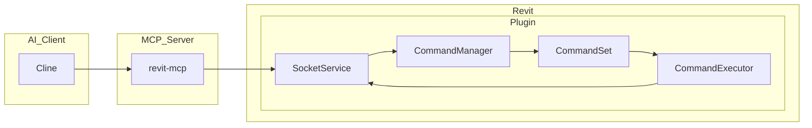

# MCP Revit Integration

## Overview

This project enables **AI-powered interaction with Autodesk Revit** through the Model Context Protocol (MCP). It combines:

- **A Node.js MCP server** that exposes Revit operations as AI-accessible tools.
- **A Revit plugin** that executes commands, queries model data, and communicates with the MCP server.

Together, they allow AI clients (like **Cline** or **Claude**) to **analyze, modify, and automate Revit models**.

---

## Features

- Query Revit model data (views, elements, families, parameters)
- Create, modify, and delete Revit elements (walls, doors, floors, etc.)
- Color-code elements based on parameters
- Tag elements automatically
- Execute custom C# code snippets inside Revit
- Extendable with your own Revit commands and MCP tools

---

## Architecture



---

## Components

### 1. MCP Server (`revit-mcp`)

- Node.js app exposing Revit operations as MCP tools
- Communicates with AI clients
- Sends commands to the Revit plugin via socket

### 2. Revit Plugin (`revit-mcp-plugin`)

- .NET plugin loaded into Revit (2019-2024)
- Registers and executes commands
- Communicates with MCP server
- Loads **Command Sets** (DLLs) for specific features

---

## Installation

### Prerequisites

- **Node.js 18+**
- **Autodesk Revit 2019-2024**
- **Visual Studio** (to build the plugin)

### 1. Build MCP Server

```bash
npm install
npm run build
```

### 2. Build Revit Plugin

- Open `plugin/revit-mcp-plugin.sln` in Visual Studio
- Set configuration to `Release` and platform to `x64`
- Build the solution
- Copy `revit-mcp-plugin.dll` and `revit-mcp-sdk.dll` to:

```
C:\Users\<YourUser>\AppData\Roaming\Autodesk\Revit\Addins\2022\
```

### 3. Register the Plugin

Create a `.addin` file in the same folder:

```xml
<?xml version="1.0" encoding="utf-8"?>
<RevitAddIns>
  <AddIn Type="Application">
    <Name>revit-mcp</Name>
    <Assembly>C:\Users\<YourUser>\AppData\Roaming\Autodesk\Revit\Addins\2022\revit-mcp-plugin.dll</Assembly>
    <FullClassName>revit_mcp_plugin.Core.Application</FullClassName>
    <ClientId>090A4C8C-61DC-426D-87DF-E4BAE0F80EC1</ClientId>
    <VendorId>revit-mcp</VendorId>
    <VendorDescription>https://github.com/BTankut/MCP_Revit</VendorDescription>
  </AddIn>
</RevitAddIns>
```

### 4. Configure MCP Server in Cline

Add to your `cline_mcp_settings.json`:

```json
{
  "mcpServers": {
    "revit-mcp": {
      "command": "node",
      "args": ["c:/Users/BT/CascadeProjects/MCP Revit/build/index.js"],
      "env": {}
    }
  }
}
```

---

## Usage

- Start Revit. The plugin loads automatically.
- Start the MCP server:

```bash
node build/index.js
```

- Open Cline or Claude.
- Use AI commands like:
  - **"List all walls"**
  - **"Create a new door here"**
  - **"Color rooms by area"**
  - **"Delete selected elements"**

---

## Extending Functionality

### Add New Revit Commands

- Develop C# commands in a **Command Set** (DLL)
- Register them in `command.json`
- Place in `Commands/YourCommandSet/2022/YourCommandSet.dll`

### Add New MCP Tools

- Create new `.ts` files in `src/tools/`
- Implement tool logic (call plugin commands, process data)
- Export as MCP tool
- Rebuild server (`npm run build`)

---

## Project Structure

- `src/` — MCP server TypeScript source
- `build/` — Compiled MCP server
- `plugin/` — Revit plugin source
- `plugin/bin/x64/Release/` — Compiled plugin DLLs
- `plugin/SampleCommandSet/` — Example command set
- `sdk_extract/` — Extracted SDK dependencies

---

## Summary

This project enables **AI-driven BIM automation** by bridging Revit and AI clients via MCP:

- **AI** issues commands
- **MCP server** translates and forwards
- **Revit plugin** executes and responds

You can **customize** both plugin commands and MCP tools to fit your workflows.

---

## License

MIT License
